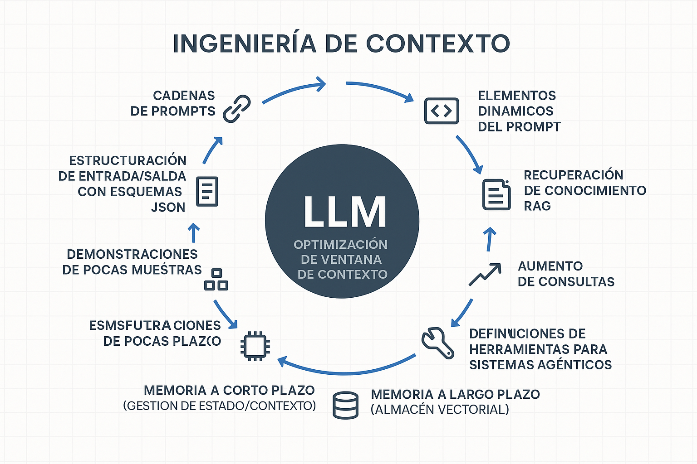
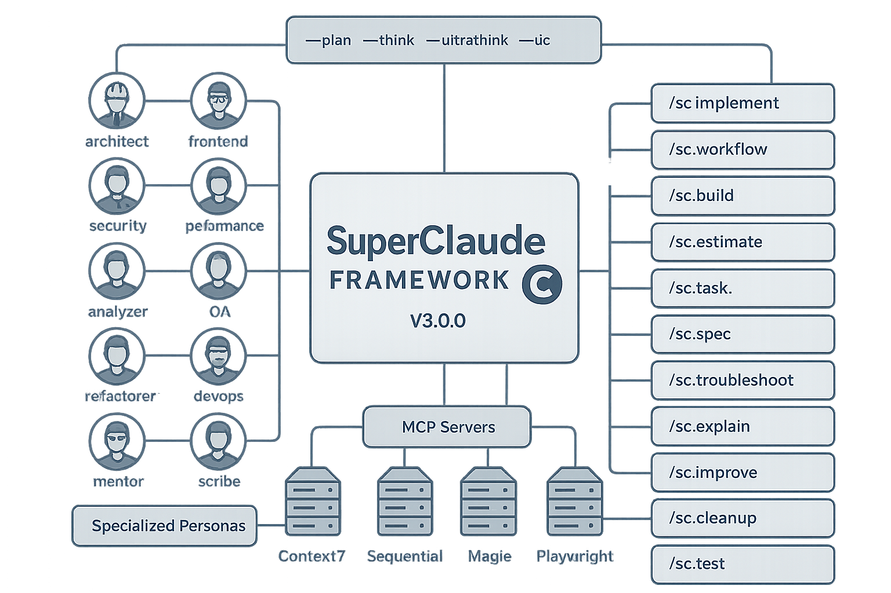
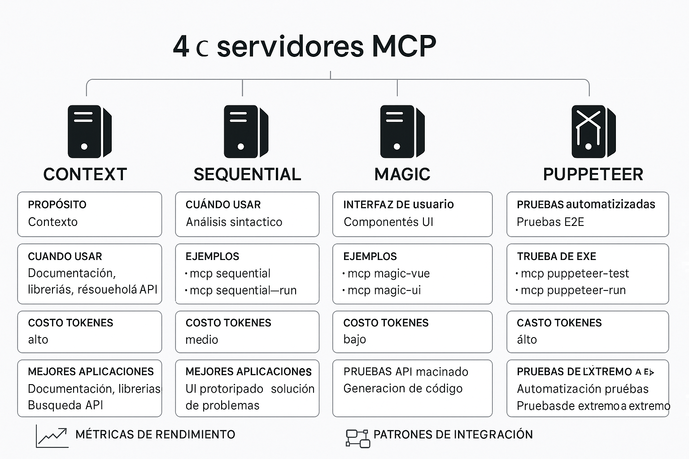

# 🏛️ Ecosistema PRP Framework
## Metodología Completa para Desarrollo Asistido por IA

[](Context-Engineering-Intro/)
[](PRPs-agentic-eng/)
[](SuperClaude_Framework-master/)
[](prp-framework-esp/)

---

## 🎯 Visión del Ecosistema


El **Ecosistema PRP Framework** representa la metodología más comprehensiva para transformar el desarrollo asistido por IA desde "vibe coding" hacia ingeniería de software estructurada de nivel enterprise. Este ecosistema proporciona una **ruta de aprendizaje progresiva** desde conceptos fundamentales hasta implementación empresarial.

### Filosofía Central
> **Context Engineering es 10x mejor que prompt engineering y 100x mejor que vibe coding.**



Este ecosistema implementa **Context Engineering** - la disciplina de ingeniería de contexto completo para asistentes de codificación IA, permitiéndoles tener toda la información necesaria para lograr tareas de extremo a extremo con calidad enterprise.

### Transformación de Valor
- 🚀 **+300% incremento de productividad** a través de desarrollo estructurado con IA
- 🏗️ **Consistencia de nivel enterprise** entre equipos de desarrollo
- 📚 **Metodología transferible** aplicable a cualquier stack tecnológico
- 🌍 **Accesibilidad global** con iniciativa de traducción al español

---

## 🗺️ Mapa de Navegación de Repositorios

### 📊 Arquitectura de Progresión de Aprendizaje

```
🎓 RUTA DE APRENDIZAJE
│
├── 🔰 Context-Engineering-Intro     → Fundamentos (21h)
│   │   ↓ Se desarrolla en
├── 🚀 PRPs-agentic-eng             → Profesional (31h)  
│   │   ↓ Evoluciona hacia
├── 🏢 SuperClaude-Framework        → Enterprise (36h)
│   │
└── 🌐 prp-framework-esp           → Ecosistema Español (~50h)
    └── Traducción completa + herramientas de automatización
```

---

## 🔰 1. Context-Engineering-Intro
### **Template Fundacional - EMPEZAR AQUÍ**

> **Perfecto para**: Desarrolladores nuevos en metodología Context Engineering

**Lo que proporciona**:
- Template fundacional para la disciplina de Context Engineering
- Introducción a metodología PRP (Product Requirements Prompt)
- Enfoque basado en templates para desarrollo estructurado con IA
- Ejemplos prácticos y patrones multi-agente

**Características Clave**:
- ✅ Template de configuración CLAUDE.md
- ✅ Workflows de generación y ejecución de PRPs
- ✅ Implementación de ejemplo multi-agente
- ✅ Carpeta de ejemplos para construcción de contexto

**Inversión de Tiempo**: 21 horas | **ROI**: Metodología estructurada vs vibe coding

📂 **[Entrar a Context-Engineering-Intro →](Context-Engineering-Intro/)**

---

## 🚀 2. PRPs-agentic-eng  
### **Metodología Profesional - Desarrolla tus Habilidades**

> **Perfecto para**: Desarrolladores listos para desarrollo de IA de nivel producción

**Lo que proporciona**:
- Colección profesional de 28+ comandos especializados
- Metodología PRP avanzada: `PRP = PRD + inteligencia de código curada + agent/runbook`
- Patrones de implementación del mundo real para entornos enterprise
- Integración con Claude Code con workflows sofisticados

**Características Clave**:
- ✅ 28+ comandos preconfigurados para Claude Code
- ✅ Templates PRP profesionales (TypeScript, Planning, Spec, Task)
- ✅ Sistema de documentación IA (13 guías especializadas)
- ✅ Ejemplos y scripts listos para producción

**Inversión de Tiempo**: 31 horas | **ROI**: +300% productividad con desarrollo agéntico estructurado

📂 **[Entrar a PRPs-agentic-eng →](PRPs-agentic-eng/)**

---

## 🏢 3. SuperClaude-Framework
### **Sistema Enterprise - Escala tu Organización**



> **Perfecto para**: Equipos implementando desarrollo de IA de nivel enterprise

**Lo que proporciona**:
- Framework enterprise más avanzado con personas especializadas e integración MCP
- 17 comandos especializados `/sc:` con orquestación inteligente
- 11 personas expertas con capacidades de auto-activación
- Metodología Evidence-Based (prohíbe lenguaje de "mejores prácticas")



**Características Clave**:
- ✅ 11 personas especializadas (architect, frontend, backend, security, etc.)
- ✅ 17 comandos enterprise con namespace `/sc:`
- ✅ 4 servidores MCP integrados (Context7, Sequential, Magic, Playwright)
- ✅ Metodología de desarrollo Evidence-Based
- ✅ Optimización de tokens y orquestación Wave System

**Inversión de Tiempo**: 36 horas | **ROI**: Estándares de desarrollo de nivel enterprise

📂 **[Entrar a SuperClaude-Framework →](SuperClaude_Framework-master/)**

---

## 🌐 4. prp-framework-esp
### **Hub de Traducción Español - Accesibilidad Global**

> **Perfecto para**: Desarrolladores hispanohablantes y contribuidores de traducción

**Lo que proporciona**:
- Traducción completa al español de todo el ecosistema PRP Framework
- Herramientas de traducción automatizada con validación de calidad
- Adaptación cultural para comunidades de desarrollo hispanohablantes
- Prueba de concepto para implementar metodologías PRP en proyectos reales

**Características Clave**:
- ✅ 37/157 archivos traducidos (24% completo)
- ✅ Herramientas de validación automatizada (>95% consistencia terminológica)
- ✅ 4 PRPs especializados para traducción sistemática
- ✅ Sistema completo de comandos slash para workflows de traducción
- ✅ Herramientas de control de calidad y adaptación cultural
- ✅ Integración SuperClaude v3 con personas y servidores MCP

**Inversión de Tiempo**: ~50 horas (reducido de 88h con automatización) | **ROI**: Acceso sin barreras para 500M+ hispanohablantes

📂 **[Entrar a prp-framework-esp →](prp-framework-esp/)**

---

## 🎓 Rutas de Aprendizaje por Nivel de Experiencia

### 🆕 Nuevo en Desarrollo con IA
**Ruta Recomendada**: Context-Engineering-Intro → PRPs-agentic-eng
1. Comenzar con comprensión del template fundacional
2. Aprender metodología PRP a través de ejemplos
3. Avanzar a colecciones de comandos profesionales
4. Considerar SuperClaude para escalado de equipo

**Compromiso de Tiempo**: 52 horas | **Resultado Esperado**: Habilidades profesionales de desarrollo con IA

### 💼 Desarrollador Experimentado
**Ruta Recomendada**: PRPs-agentic-eng → SuperClaude-Framework
1. Saltar directamente a metodología profesional
2. Implementar workflows de nivel producción
3. Escalar a enterprise con personas y MCP
4. Referenciar Context-Engineering-Intro según necesidad

**Compromiso de Tiempo**: 67 horas | **Resultado Esperado**: Experiencia en desarrollo de IA lista para enterprise

### 🏢 Equipo Enterprise
**Ruta Recomendada**: SuperClaude-Framework + Implementación Estratégica
1. Comenzar con visión general del framework enterprise
2. Implementar metodología Evidence-Based
3. Desplegar personas e integración MCP en todo el equipo
4. Usar otros repositorios como materiales de formación

**Compromiso de Tiempo**: 36+ horas | **Resultado Esperado**: Transformación organizacional de desarrollo con IA

### 🌍 Comunidad Hispanohablante
**Ruta Recomendada**: prp-framework-esp → Contribuir a la Traducción
1. Acceder al ecosistema completo en español
2. Seguir workflows de traducción sistemática
3. Contribuir al esfuerzo de traducción en curso
4. Aplicar metodología PRP a proyectos personales

**Compromiso de Tiempo**: Variable | **Resultado Esperado**: Acceso completo al ecosistema + oportunidad de contribución

---

## 🚀 Implementación Rápida

### Valor Inmediato (5 minutos)
```bash
# Para principiantes - empezar con fundamentos
cd Context-Engineering-Intro/
cat README.md

# Para desarrolladores experimentados - saltar a profesional
cd PRPs-agentic-eng/
cat README.md

# Para equipos enterprise - comenzar con framework avanzado
cd SuperClaude_Framework-master/
cat README.md

# Para hispanohablantes - acceder al ecosistema traducido con comandos completos
cd prp-framework-esp/
cat uso-comandos.md    # Manual completo de comandos y workflows
cat CLAUDE.md         # Guía sistema completa en español
```

### Comandos Especializados de Traducción
```bash
# Instalar SuperClaude v3 (prerequisito)
git clone https://github.com/NomenAK/SuperClaude.git && cd SuperClaude && uv sync && python3 SuperClaude install

# Ejecutar traducciones con PRPs especializados
/traducir-archivo-execute PRPs/traduccion-context-engineering-intro-completa.md --persona-scribe --think-hard
/traducir-archivo-execute PRPs/traduccion-prps-agentic-eng-completa.md --persona-scribe --c7
/traducir-archivo-execute PRPs/traduccion-superclaude-framework-completa.md --persona-architect --seq
/traducir-archivo-execute PRPs/traduccion-servidor-mcp-completa.md --persona-scribe --ultrathink

# Validar calidad y terminología
/validar-terminologia --directorio repositorios/[framework]/ --persona-qa
/status-traduccion --framework [nombre] --detallado
/generar-reporte --tipo completo --persona-analyzer
```

### Implementación Profunda (Por Repositorio)
Cada repositorio contiene guías comprehensivas de configuración e implementación:
- **Instrucciones de configuración** para entorno de desarrollo
- **Templates de inicio rápido** para productividad inmediata
- **Configuración avanzada** para implementación en equipo
- **Ejemplos del mundo real** con resultados documentados

---

## 📊 Estado del Ecosistema y Métricas

### Salud de Repositorios
| Repositorio | Estado | Completitud | Última Actualización | Comunidad |
|------------|--------|-------------|---------------------|-----------|
| Context-Engineering-Intro | ✅ Estable | 100% | Activo | Creciendo |
| PRPs-agentic-eng | ✅ Estable | 100% | Activo | Profesional |
| SuperClaude-Framework | 🔄 v3.0.0 | 100% | Reciente | Enterprise |
| prp-framework-esp | 🚧 Traducción | 24% (37/157 archivos) | Activo | Contribuyendo |

### Detalle de Progreso de Traducción
- **Context-Engineering-Intro**: 35% completo (6/17 archivos)
- **PRPs-agentic-eng**: 34% completo (22/64 archivos)
- **SuperClaude-Framework**: 0% completo (0/38 archivos)
- **Servidor MCP**: 24% completo (9/38 archivos) - documentación principal

### Métricas del Ecosistema
- **Tiempo total de aprendizaje**: 88 horas entre todos los repositorios
- **Herramientas automatizadas**: Reducen tiempo de implementación en 43%
- **Validación de calidad**: >95% consistencia terminológica en traducciones
- **Sistema de comandos**: 6 comandos slash especializados para traducción
- **SuperClaude v3**: 10 personas + 4 servidores MCP integrados
- **Impacto comunitario**: 500M+ desarrolladores hispanohablantes potenciales

---

## 🤝 Comunidad y Contribución

### Para Contribuidores
- **Traducción**: Únete al esfuerzo de traducción español en `prp-framework-esp/`
- **Documentación**: Mejora guías y ejemplos entre repositorios
- **Herramientas**: Mejora sistemas de automatización y validación
- **Casos de Uso**: Documenta experiencias de implementación del mundo real

### Para Organizaciones
- **Formación**: Usa repositorios como currículo de aprendizaje estructurado
- **Implementación**: Despliega metodologías en equipos de desarrollo
- **Personalización**: Adapta frameworks para stacks tecnológicos específicos
- **Escalado**: Contribuye aprendizajes organizacionales de vuelta a la comunidad

### Comenzando con Contribución
1. **Elige tu punto de entrada** basado en nivel de experiencia
2. **Implementa metodología** en proyectos personales/de equipo
3. **Documenta experiencias** y mejoras
4. **Comparte aprendizajes** con la comunidad del ecosistema
5. **Contribuye mejoras** de vuelta a repositorios relevantes

---

## 📚 Recursos Ejecutivos

### Visión Estratégica
- 📊 **[Resumen Ejecutivo Completo](prp-framework-esp/informes-ejecutivos/00-resumen-ejecutivo-completo.md)** - Análisis comprehensivo de todos los repositorios
- 🎯 **Análisis ROI**: 88 horas de inversión → Capacidades de desarrollo de IA de nivel enterprise
- 📈 **Métricas de Éxito**: >300% incremento de productividad documentado entre implementaciones

### Guías de Implementación
- 🔰 **Fundamentos**: [Guía Context Engineering Intro](Context-Engineering-Intro/README.md)
- 🚀 **Profesional**: [Visión General PRPs Agentic Engineering](PRPs-agentic-eng/README.md)  
- 🏢 **Enterprise**: [Documentación SuperClaude Framework](SuperClaude_Framework-master/README.md)
- 🌐 **Ecosistema Español**: [Manual de Uso Completo](prp-framework-esp/uso-comandos.md)

### Aseguramiento de Calidad
- ✅ **Herramientas de Validación**: Consistencia terminológica automatizada (>95% precisión)
- ✅ **Seguimiento de Progreso**: Métricas en tiempo real entre todos los repositorios
- ✅ **Adaptación Cultural**: Localización española con precisión técnica
- ✅ **Estándares Enterprise**: Implementación de metodología Evidence-Based

---

## 🎯 Próximos Pasos

### Elige tu Ruta

1. **🔰 ¿Nuevo en Context Engineering?**  
   → Comienza con [Context-Engineering-Intro](Context-Engineering-Intro/)

2. **🚀 ¿Listo para Implementación Profesional?**  
   → Salta a [PRPs-agentic-eng](PRPs-agentic-eng/)

3. **🏢 ¿Implementando a Escala Enterprise?**  
   → Comienza con [SuperClaude-Framework](SuperClaude_Framework-master/)

4. **🌍 ¿Desarrollador Hispanohablante?**  
   → Accede a [prp-framework-esp](prp-framework-esp/)

### Punto de Partida Universal
**Todas las rutas se benefician de entender los conceptos fundamentales en Context-Engineering-Intro** - incluso desarrolladores experimentados obtienen valor del enfoque estructurado a la metodología Context Engineering.

---

## 📄 Licencia y Uso

Todos los repositorios mantienen compatibilidad con **Licencia MIT**, asegurando:
- ✅ Uso gratuito para proyectos comerciales y personales
- ✅ Derechos de modificación y distribución
- ✅ Integración compatible entre diferentes stacks tecnológicos
- ✅ Contribución y mejora comunitaria

---

## 🙏 Reconocimientos y Créditos

### Creadores Originales del Framework PRP

Este ecosistema está basado en el trabajo pionero de:

**🎯 [Rasmus Widing](https://github.com/Wirasm/PRPs-agentic-eng)** - **Creador del Framework PRP**
- Autor original de la metodología PRP (Product Requirements Prompt)
- Desarrollador del enfoque agentic engineering profesional
- Fundador de la colección de 28+ comandos especializados
- **Repositorio original**: https://github.com/Wirasm/PRPs-agentic-eng

**🔰 [Cole Medin](https://github.com/coleam00/context-engineering-intro)** -
- Contribución fundamental en la enseñanza sobre IA generativa
- Mentor en metodologías estructuradas para desarrollo con IA
- **Repositorio original**: https://github.com/coleam00/context-engineering-intro

**🏢 [SuperClaude Organization](https://github.com/SuperClaude-Org/SuperClaude_Framework)** - **Framework Enterprise**
- Desarrollo del sistema enterprise más avanzado con personas y MCP
- Implementación de metodología Evidence-Based
- Equipo de desarrollo: https://superclaude.org/
- **Repositorio original**: https://github.com/SuperClaude-Org/SuperClaude_Framework

### Sobre Este Proyecto de Traducción

Este repositorio (`prp-completo-docs`) es una **iniciativa de traducción y documentación** que:

- ✅ **Preserva y honra** el trabajo original de los creadores
- ✅ **Hace accesible** el ecosistema completo a la comunidad hispanohablante
- ✅ **Aplica las metodologías PRP** como prueba de concepto en un proyecto real
- ✅ **Contribuye** herramientas de automatización y control de calidad
- ✅ **Documenta** la implementación práctica de Context Engineering

**Nota importante**: Este proyecto es un esfuerzo comunitario independiente de traducción y documentación. Para acceder a los frameworks originales y sus últimas actualizaciones, visita los repositorios oficiales mencionados arriba.

---

**Transforma tu flujo de trabajo de desarrollo desde vibe coding hacia asistencia de IA de nivel enterprise. Elige tu punto de entrada y comienza el viaje hacia productividad 10x.**

*Ecosistema PRP Framework - Metodología comprehensiva para desarrollo profesional asistido por IA*