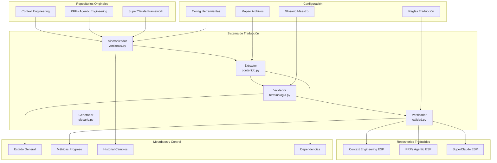
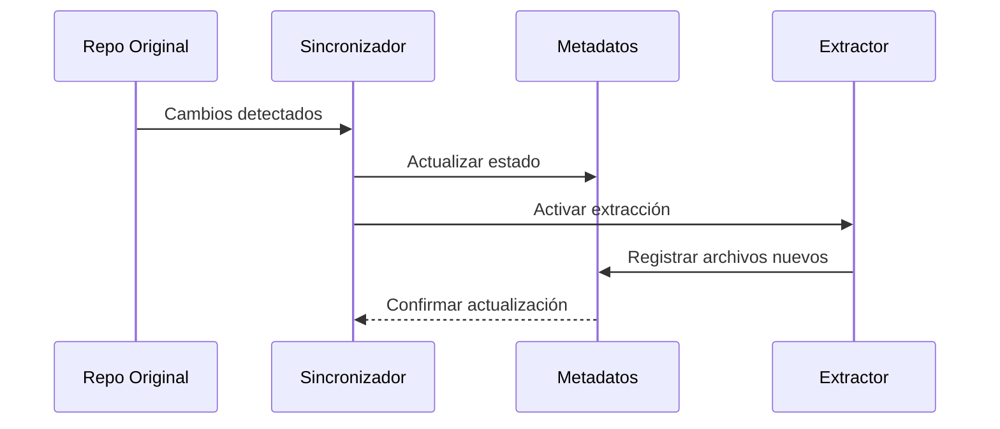
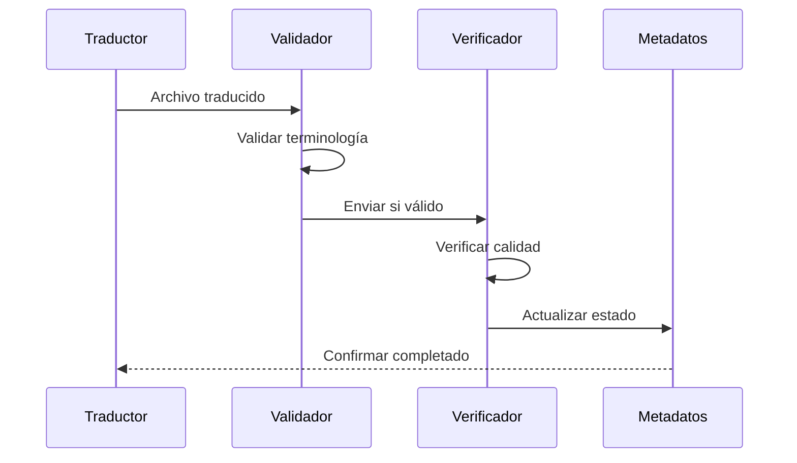
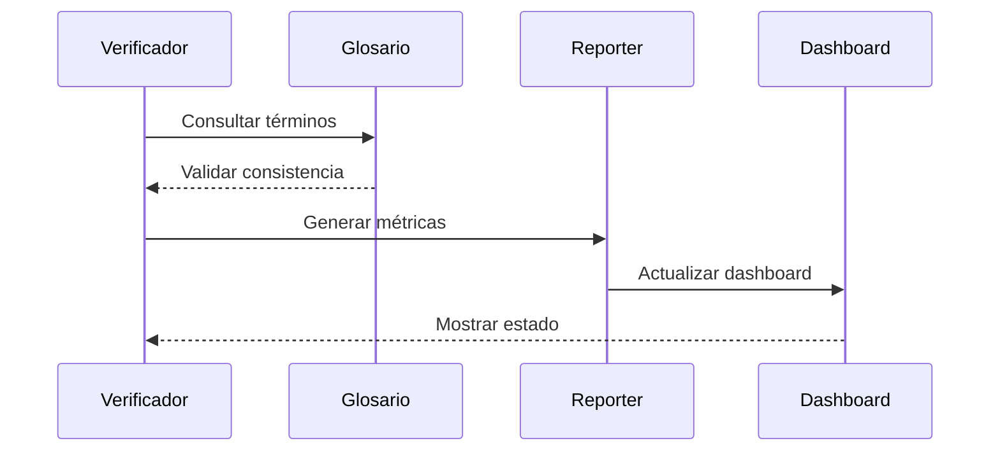

# 🏗️ Arquitectura del Sistema de Traducción PRP Framework

## 🎯 Visión Arquitectónica

La infraestructura de traducción PRP Framework está diseñada siguiendo principios de **Systems Design** y **Long-term Architecture**, priorizando escalabilidad, mantenibilidad y eficiencia operacional.

## 📊 Arquitectura de Alto Nivel



## 🔧 Componentes del Sistema

### 1. **Capa de Sincronización**

**Responsabilidades**:
- Monitoreo cambios en repositorios originales
- Versionado y control de dependencias
- Detección de archivos nuevos/modificados
- Mantenimiento coherencia temporal

**Componentes**:
```python
sincronizador-versiones.py
├── GitMonitor: Seguimiento cambios repositorios
├── VersionManager: Control versiones y tags
├── DependencyResolver: Resolución dependencias archivos
└── ChangeDetector: Detección cambios relevantes
```

### 2. **Capa de Extracción y Análisis**

**Responsabilidades**:
- Parsing estructura archivos Markdown
- Identificación contenido traducible vs código
- Extracción metadatos y referencias
- Análisis complejidad terminológica

**Componentes**:
```python
extractor-contenido.py
├── MarkdownParser: Parsing avanzado MD
├── ContentClassifier: Clasificación contenido
├── MetadataExtractor: Extracción metadatos
├── ComplexityAnalyzer: Análisis complejidad
└── ReferenceResolver: Resolución referencias
```

### 3. **Capa de Validación Terminológica**

**Responsabilidades**:
- Validación consistencia términos técnicos
- Aplicación reglas glosario maestro
- Detección inconsistencias y errores
- Generación reportes calidad terminológica

**Componentes**:
```python
validador-terminologia.py
├── GlossaryManager: Gestión glosario maestro
├── TermValidator: Validación términos específicos
├── ConsistencyChecker: Verificación consistencia
├── ErrorReporter: Generación reportes errores
└── SuggestionEngine: Motor sugerencias corrección
```

### 4. **Capa de Control de Calidad**

**Responsabilidades**:
- Verificación integridad traducciones
- Validación preservación estructura
- Testing funcionalidad enlaces y código
- Métricas calidad cuantificables

**Componentes**:
```python
verificador-calidad.py
├── StructureValidator: Validación estructura MD
├── LinkChecker: Verificación enlaces
├── CodeIntegrityChecker: Integridad código
├── QualityMetrics: Métricas calidad
└── ReportGenerator: Generación reportes
```

### 5. **Capa de Gestión Terminológica**

**Responsabilidades**:
- Gestión evolutiva glosario maestro
- Detección términos nuevos
- Proposición traducciones automáticas
- Mantenimiento coherencia semántica

**Componentes**:
```python
generador-glosario.py
├── TermExtractor: Extracción términos nuevos
├── AutoTranslator: Traducción automática sugerida
├── SemanticAnalyzer: Análisis semántico
├── GlossaryUpdater: Actualización glosario
└── ValidationEngine: Validación propuestas
```

## 📁 Organización de Datos

### Estructura de Metadatos

```json
{
  "estado-general.json": {
    "proposito": "Estado global del proyecto traducción",
    "contenido": {
      "frameworks": ["context-engineering", "prps-agentic", "superclaude"],
      "progreso_total": "percentage",
      "archivos_pendientes": "array",
      "archivos_completados": "array",
      "ultima_sincronizacion": "timestamp"
    }
  },
  
  "metricas-progreso.json": {
    "proposito": "Métricas cuantificables progreso",
    "contenido": {
      "velocidad_traduccion": "archivos/dia",
      "calidad_promedio": "percentage",
      "consistencia_terminologica": "percentage",
      "tiempo_revision": "horas"
    }
  },
  
  "dependencias-archivos.json": {
    "proposito": "Grafo dependencias entre archivos",
    "contenido": {
      "archivo_origen": {
        "dependencias": ["lista_archivos"],
        "referenciado_por": ["lista_archivos"],
        "prioridad_traduccion": "numero"
      }
    }
  }
}
```

### Organización Repositorios Traducidos

```
repositorios/
└── [framework]-esp/
    ├── contenido/           # Archivos traducidos
    │   ├── README-es.md
    │   ├── CLAUDE-es.md
    │   └── [estructura_original]/
    ├── meta/               # Metadatos específicos framework
    │   ├── estado-traduccion.json
    │   ├── glosario-terminos.json
    │   ├── mapeo-archivos.json
    │   └── metricas-calidad.json
    └── temporal/           # Archivos trabajo temporal
        ├── borradores/
        ├── revisiones/
        └── backups/
```

## 🔄 Flujos de Datos

### 1. **Flujo de Sincronización**



### 2. **Flujo de Traducción**



### 3. **Flujo de Control de Calidad**



## ⚙️ Configuración del Sistema

### Variables de Entorno

```toml
[configuracion.sistema]
# Rutas base
REPO_ORIGINALES = "../"
REPO_TRADUCIDOS = "./repositorios/"
HERRAMIENTAS = "./herramientas/"
METADATOS = "./metadatos/"

# Configuración sincronización
INTERVALO_SYNC = "1h"      # Frecuencia sincronización
TIMEOUT_OPERACION = "30s"  # Timeout operaciones
MAX_CONCURRENCIA = 3       # Procesos paralelos máximos

# Configuración calidad
UMBRAL_CALIDAD = 0.95      # Umbral mínimo calidad
UMBRAL_CONSISTENCIA = 0.90 # Umbral consistencia terminológica
MODO_ESTRICTO = true       # Validación estricta

# Configuración reportes
GENERAR_REPORTES = true
FORMATO_REPORTE = "markdown"
INCLUIR_METRICAS = true
```

### Configuración Herramientas

```yaml
herramientas:
  validador-terminologia:
    modo_validacion: "estricto"
    incluir_sugerencias: true
    generar_reportes: true
    umbral_error: 0.05
    
  verificador-calidad:
    verificar_enlaces: true
    validar_codigo: true
    generar_metricas: true
    modo_verbose: false
    
  sincronizador-versiones:
    auto_sync: true
    backup_antes_sync: true
    notificar_cambios: true
    intervalo_check: "1h"
    
  generador-glosario:
    auto_deteccion: true
    sugerir_traducciones: true
    validar_propuestas: true
    actualizar_automatico: false
```

## 🚀 Escalabilidad y Performance

### Consideraciones Arquitectónicas

**Principios de Escalabilidad**:
1. **Modularidad**: Componentes independientes y reemplazables
2. **Paralelización**: Procesamiento concurrente archivos independientes  
3. **Caching**: Cache inteligente para validaciones repetitivas
4. **Incremental**: Procesamiento solo de cambios detectados

**Optimizaciones Performance**:
- **Indexación**: Índices para búsqueda rápida términos
- **Batching**: Procesamiento por lotes para eficiencia
- **Lazy Loading**: Carga bajo demanda de glosarios grandes
- **Compression**: Compresión metadatos para storage eficiente

### Métricas de Performance

```python
metricas_performance = {
    "throughput": {
        "archivos_por_minuto": "target: 10",
        "validaciones_por_segundo": "target: 100",
        "sincronizaciones_por_hora": "target: 1"
    },
    "latencia": {
        "validacion_archivo": "target: <5s",
        "sincronizacion_completa": "target: <30s",
        "generacion_reporte": "target: <10s"
    },
    "recursos": {
        "memoria_maxima": "512MB",
        "cpu_utilizacion": "<50%",
        "storage_crecimiento": "<10MB/dia"
    }
}
```

## 🔒 Seguridad y Confiabilidad

### Medidas de Seguridad

1. **Validación Input**: Sanitización archivos entrada
2. **Sandboxing**: Ejecución aislada herramientas externas
3. **Backup**: Respaldo automático antes de modificaciones
4. **Logging**: Trazabilidad completa operaciones
5. **Recovery**: Procedimientos recuperación ante fallos

### Estrategias de Confiabilidad

- **Redundancia**: Múltiples validaciones independientes
- **Rollback**: Capacidad deshacer cambios problemáticos
- **Health Checks**: Monitoreo salud sistema continuo
- **Graceful Degradation**: Funcionamiento parcial si componentes fallan

## 🔮 Evolución Futura

### Roadmap Arquitectónico

**V1.1**: Optimización performance y herramientas adicionales
**V1.2**: Interface web para gestión visual traducciones
**V1.3**: Integración AI para traducción automática asistida  
**V2.0**: Sistema distribuido para equipos grandes

### Extensibilidad

El sistema está diseñado para futuras extensiones:
- **Plugins**: Arquitectura plugin para herramientas personalizadas
- **APIs**: Interfaces programáticas para integración externa
- **Hooks**: Sistema eventos para automatización custom
- **Adapters**: Adaptadores para nuevos formatos documentación

---

*Arquitectura del Sistema PRP Framework v1.0 - Diseñada para escalabilidad, mantenibilidad y evolución continua*