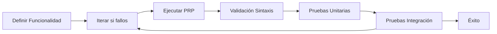

# 📋 Informe Ejecutivo: Context-Engineering-Intro

**Repositorio**: Context-Engineering-Intro  
**Fecha de Análisis**: 19 de julio 2025  
**Público Objetivo**: Desarrolladores hispanohablantes  
**Nivel**: Principiante a Intermedio  

## 🎯 Resumen Ejecutivo

**Context-Engineering-Intro** es un framework educativo que introduce la **Ingeniería de Contexto**, una disciplina que supera el prompt engineering tradicional para crear sistemas de desarrollo de software asistido por IA más efectivos y predecibles.

### Valor Principal
- **Metodología sistemática** para trabajo con asistentes IA
- **Patrones probados** que reducen fallos y iteraciones
- **Framework educativo progresivo** desde conceptos básicos hasta implementaciones complejas
- **Casos de uso prácticos** con ejemplos completos

## 📚 Contenido y Estructura Documental

### Documentos Clave para Traducir

| Archivo | Prioridad | Complejidad | Horas Est. | Descripción |
|---------|-----------|-------------|------------|-------------|
| `README.md` | **Alta** | Media | 3h | Guía principal y tutorial completo |
| `CLAUDE.md` | **Alta** | Alta | 4h | Reglas globales para asistentes IA |
| `PRPs/templates/prp_base.md` | **Alta** | Alta | 5h | Template base para PRPs |
| `INITIAL.md` | Media | Media | 2h | Plantilla para solicitudes |
| `PRPs/EXAMPLE_multi_agent_prp.md` | Media | Alta | 6h | Ejemplo completo multi-agente |
| `INITIAL_EXAMPLE.md` | Baja | Baja | 1h | Ejemplo práctico básico |

**Total estimado**: **21 horas** de traducción especializada

### Arquitectura del Conocimiento

```
Context-Engineering-Intro/
├── 📖 Documentos Base
│   ├── README.md           # Tutorial principal
│   ├── CLAUDE.md          # Configuración global
│   └── INITIAL.md         # Template solicitudes
├── 🔧 Sistema PRP
│   ├── templates/         # Plantillas estructuradas
│   └── examples/          # Casos de uso reales
├── ⚙️ Comandos Claude Code
│   ├── generate-prp.md    # Generación automática
│   └── execute-prp.md     # Ejecución guiada
└── 🎯 Casos de Uso
    └── mcp-server/        # Servidor MCP completo
```

## 🧠 Conocimientos y Metodologías

### 1. Context Engineering vs Prompt Engineering

**Paradigma Tradicional**:
- Enfoque en redacción inteligente de prompts
- Limitado a formulación de tareas
- Equivale a "dar una nota adhesiva"

**Nuevo Paradigma (Context Engineering)**:
- Sistema completo de contexto integral
- Incluye documentación, ejemplos, reglas y validación
- Equivale a "escribir un guión completo"

### 2. Metodología PRP (Product Requirements Prompt)

Los PRPs son **documentos de implementación integral** que incluyen:

- **📋 Contexto Completo**: Documentación y ejemplos relevantes
- **🔄 Pasos de Implementación**: Con validación en cada etapa
- **⚠️ Manejo de Errores**: Estrategias probadas
- **✅ Requisitos de Pruebas**: Validación automatizada
- **🔁 Bucles de Auto-corrección**: Permiten que la IA corrija errores

### 3. Conceptos Clave

| Concepto | Descripción | Aplicación |
|----------|-------------|------------|
| **Context is King** | El contexto es la clave del éxito | Proporcionar toda la información relevante |
| **Validation Loops** | Bucles de validación ejecutables | Comandos que la IA puede ejecutar y corregir |
| **Information Dense** | Información densa con patrones | Usar keywords del codebase existente |
| **Progressive Success** | Éxito progresivo | Simple → validar → mejorar |

### 4. Flujo de Trabajo Sistemático



## 🛠️ Herramientas y Tecnologías

### Framework Base
- **Claude Code**: CLI oficial de Anthropic
- **Comandos personalizados**: `/generate-prp`, `/execute-prp`
- **TodoWrite**: Gestión de tareas integrada

### Ejemplo Multi-Agente
- **PydanticAI**: Sistemas multi-agente
- **Brave Search API**: Investigación automatizada
- **Gmail API**: Creación de borradores
- **FastAPI + SQLAlchemy**: Backend moderno

### Caso de Uso MCP Servers
- **Model Context Protocol (MCP)**: Extensión de capacidades
- **TypeScript + Cloudflare Workers**: Despliegue serverless
- **GitHub OAuth**: Autenticación segura
- **PostgreSQL**: Base de datos con protección

## 📈 Valor para Desarrolladores Hispanohablantes

### Beneficios Educativos

**Para Principiantes**:
- ✅ Metodología sistemática clara
- ✅ Patrones probados y reutilizables
- ✅ Reducción de curva de aprendizaje
- ✅ Ejemplos prácticos completos

**Para Desarrolladores Experimentados**:
- ✅ Maximización de efectividad con IA
- ✅ Patrones avanzados multi-agente
- ✅ Arquitecturas de producción
- ✅ Seguridad integrada desde diseño

### Beneficios Técnicos

- **🔥 Reducción de Errores**: Los fallos de IA son fallos de contexto, no del modelo
- **⚡ Incremento Productividad**: Implementación exitosa en una sola pasada
- **📊 Escalabilidad**: Arquitecturas modulares y extensibles
- **🔒 Seguridad**: Patrones de seguridad integrados

### Oportunidades de Localización

**Adaptaciones para España/Latinoamérica**:
- 🏦 Integraciones con APIs bancarias locales
- 💳 Servicios de pago regionales (Bizum, PSE, etc.)
- 🏛️ Sistemas gubernamentales digitales
- 🛒 E-commerce específico de cada región

**Casos de Uso Regionales**:
- **Fintech**: Banca digital, criptomonedas
- **HealthTech**: Telemedicina, historia clínica
- **GovTech**: Gestión municipal, trámites digitales
- **AgriTech**: Agricultura de precisión, trazabilidad

## 🎓 Dependencias de Aprendizaje

### Prerequisitos Técnicos
- **Claude Code**: Instalación y configuración básica
- **Git**: Control de versiones (nivel básico)
- **Markdown**: Escritura de documentación
- **APIs REST**: Comprensión básica de integración

### Flujo de Aprendizaje Recomendado

```
1. README.md           # Conceptos fundamentales
   ↓
2. CLAUDE.md          # Configuración del sistema
   ↓  
3. INITIAL_EXAMPLE.md # Ejemplo práctico simple
   ↓
4. PRP Templates      # Plantillas estructuradas
   ↓
5. Multi-Agent PRP    # Caso complejo
   ↓
6. MCP Use Case       # Implementación avanzada
```

### Tiempo de Aprendizaje Estimado
- **Básico** (conceptos + ejemplo simple): 8-12 horas
- **Intermedio** (PRPs + template): 16-24 horas  
- **Avanzado** (multi-agente + MCP): 32-48 horas

## 🎯 Recomendaciones de Traducción

### Prioridad de Traducción

**Fase 1 - Fundamentos** (1-2 semanas):
1. `README.md` - Base conceptual
2. `CLAUDE.md` - Configuración sistema
3. `INITIAL_EXAMPLE.md` - Primer ejemplo

**Fase 2 - Metodología** (2-3 semanas):
4. `INITIAL.md` - Plantilla solicitudes
5. `PRPs/templates/prp_base.md` - Template principal

**Fase 3 - Casos Avanzados** (3-4 semanas):
6. `PRPs/EXAMPLE_multi_agent_prp.md` - Caso complejo
7. Comandos Claude Code
8. Documentación MCP Server

### Consideraciones Especiales

**Terminología a Preservar**:
- Context Engineering, PRP, Claude Code
- Nombres de APIs y servicios técnicos
- Comandos y sintaxis específica

**Adaptaciones Recomendadas**:
- Ejemplos empresariales hispanohablantes
- Referencias culturales apropiadas
- Casos de uso regionales específicos

## 💡 Conclusión

Context-Engineering-Intro es un **framework educativo excepcional** que democratiza el acceso a metodologías avanzadas de desarrollo asistido por IA. Su traducción al español representaría una **contribución significativa** a la comunidad de desarrollo hispanohablante.

**Valor estimado**: Alto impacto educativo con 21 horas de traducción especializada que pueden beneficiar a miles de desarrolladores en el ecosistema hispanohablante.

**Recomendación**: ⭐⭐⭐⭐⭐ **Altamente recomendado para traducción** - Framework fundamental que establece bases sólidas para el desarrollo moderno.