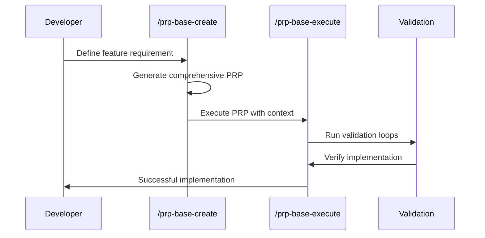

# 📋 Informe Ejecutivo: PRPs-agentic-eng

**Repositorio**: PRPs-agentic-eng  
**Fecha de Análisis**: 19 de julio 2025  
**Público Objetivo**: Desarrolladores hispanohablantes  
**Nivel**: Intermedio a Avanzado  

## 🎯 Resumen Ejecutivo

**PRPs-agentic-eng** representa la **evolución sofisticada del Context Engineering hacia la Ingeniería Agéntica**. Este framework establece una metodología sistemática para el desarrollo de software asistido por IA mediante **Product Requirement Prompts (PRPs)**, optimizado específicamente para Claude Code con un enfoque en **implementaciones exitosas en el primer intento**.

### Valor Principal
- **Metodología PRP madura**: `PRP = PRD + curated codebase intelligence + agent/runbook`
- **28+ comandos preconfigurados** para Claude Code
- **Arquitectura agéntica** con orquestación de múltiples agentes
- **Casos de uso del mundo real** con implementaciones completas

## 📚 Contenido y Estructura Documental

### Documentos Clave para Traducir

| Archivo | Prioridad | Complejidad | Horas Est. | Descripción |
|---------|-----------|-------------|------------|-------------|
| `README.md` | **Alta** | Media | 4h | Guía principal metodología PRP |
| `CLAUDE.md` | **Alta** | Muy Alta | 8h | Configuración SuperClaude con 28+ comandos |
| `PRPs/templates/prp_base.md` | **Alta** | Muy Alta | 10h | Template comprensivo con loops validación |
| `PRPs/scripts/prp_runner.py` | Media | Alta | 6h | Ejecutor de PRPs (solo comentarios) |
| `PRPs/ai_docs/cc_overview.md` | **Alta** | Media | 3h | Documentación Claude Code completa |

**Total estimado**: **31 horas** de traducción especializada

### Arquitectura del Conocimiento

```
PRPs-agentic-eng/
├── 📖 Documentación Central
│   ├── README.md              # Metodología PRP completa
│   └── CLAUDE.md             # SuperClaude config (28+ comandos)
├── 🎯 Sistema PRP
│   ├── templates/            # Templates estructurados
│   │   ├── prp_base.md      # Template comprensivo
│   │   ├── prp_planning.md  # Planificación con diagramas
│   │   └── prp_spec.md      # Especificaciones técnicas
│   ├── ai_docs/             # Documentación IA curada (13 archivos)
│   ├── scripts/             # Herramientas de ejecución
│   └── examples/            # PRPs del mundo real
├── ⚙️ Comandos Claude Code
│   └── .claude/commands/    # 28+ comandos preconfigurados
├── 🏗️ Casos de Uso
│   └── use-cases/           # Implementaciones completas
└── 📋 CLAUDE.md Específicos
    └── claude_md_files/     # Configuraciones por framework
```

## 🧠 Conocimientos y Metodologías

### 1. Evolución de la Metodología PRP

**Concepto Central**: 
```
PRP = PRD + curated codebase intelligence + agent/runbook
```

**Diferencias con PRD Tradicional**:
- **PRD**: Especifica qué construir y por qué
- **PRP**: Añade **cómo construir** explícitamente para IA:
  - 📁 Contexto preciso (rutas, versiones, ejemplos)
  - 🔧 Detalles de implementación (APIs, patrones, dependencias)
  - ✅ Puertas de validación (pytest, ruff, type checking)

### 2. Arquitectura de Comandos Integrada (28+ Comandos)

#### Comandos PRP Core
- `/prp-base-create`: Generar PRPs comprensivos
- `/prp-base-execute`: Ejecutar PRPs con validación
- `/prp-parallel-research`: Investigación con 4 agentes paralelos

#### Comandos de Desarrollo
- `/prime-core`: Optimización de configuración base
- `/onboarding`: Integración de nuevos desarrolladores
- `/debug-wizard`: Asistente de debugging inteligente

#### Comandos de Calidad
- `/code-review`: Revisión de código estructurada
- `/refactor-assistant`: Refactorización guiada

#### Comandos Git Inteligentes
- `/resolve-conflicts`: Resolución automática de conflictos
- `/commit-smart`: Commits inteligentes con mensajes descriptivos

### 3. Ingeniería de Contexto Especializada

#### Documentación IA Curada (`PRPs/ai_docs/`)
- **13 archivos especializados** de documentación Claude Code
- **Patrones MCP**: Model Context Protocol para servidores externos
- **Workflows comunes**: Metodologías probadas de desarrollo

#### Templates Estructurados
- **prp_base.md**: Template comprensivo con loops de validación
- **prp_planning.md**: Documentos de planificación con diagramas
- **prp_spec.md**: Especificaciones técnicas detalladas

### 4. Patrones de Implementación Probados

| Patrón | Descripción | Aplicación |
|--------|-------------|------------|
| **Context is King** | Inclusión de TODA la documentación necesaria | Documentación, ejemplos, advertencias |
| **Validation Loops** | Comandos ejecutables que la IA puede correr | `ruff check`, `pytest`, `uvicorn` |
| **Information Dense** | Keywords y patrones del codebase | Uso de terminología específica del proyecto |
| **Progressive Success** | Comenzar simple, validar, mejorar | Implementación incremental con validación |

## 🛠️ Herramientas y Tecnologías

### Stack Tecnológico Soportado
- **Gestión de paquetes**: UV Package Management (moderno)
- **Testing**: pytest con cobertura completa
- **Linting**: ruff para sintaxis y estilo
- **Type checking**: mypy para verificación de tipos
- **Web frameworks**: FastAPI, uvicorn
- **APIs**: Brave Search, Gmail, GitHub

### Herramientas Especializadas
- **Claude Code SDK**: Integración nativa con herramientas
- **MCP Servers**: Extensión de capacidades mediante servidores externos
- **Parallel Research**: Coordinación de múltiples agentes de investigación
- **PydanticAI**: Framework para sistemas multi-agente

### Metodología de Validación en Capas

```bash
# Nivel 1: Sintaxis y Estilo
ruff check --fix && mypy .

# Nivel 2: Pruebas Unitarias  
uv run pytest tests/ -v

# Nivel 3: Integración
uv run uvicorn main:app --reload

# Nivel 4: Despliegue
# Servidores MCP u otros métodos creativos
```

## 📈 Valor para Desarrolladores Hispanohablantes

### Beneficios Educativos

**Para Desarrolladores Intermedios**:
- ✅ Metodología estructurada avanzada
- ✅ Patrones de arquitectura probados
- ✅ Herramientas de productividad enterprise
- ✅ Casos de uso complejos del mundo real

**Para Equipos de Desarrollo**:
- ✅ Estándares consistentes para desarrollo con IA
- ✅ Reducción de fallos mediante contexto integral
- ✅ Procesos reproducibles y escalables
- ✅ Orquestación de agentes especializados

### Beneficios Técnicos

- **🎯 Precisión en Implementación**: Éxito en primer intento mediante contexto comprensivo
- **🏗️ Arquitectura Escalable**: Patrones modulares y extensibles
- **⚡ Eficiencia de Desarrollo**: Automatización de tareas complejas multi-paso
- **🔒 Calidad Integrada**: Estándares de validación incorporados

### Casos de Uso Específicos

**Desarrollo de APIs**:
- 🔧 FastAPI con documentación automática
- 🗄️ Integración con bases de datos (SQLAlchemy)
- 🔐 Autenticación y autorización
- 📊 Monitoreo y logging

**Sistemas Multi-Agente**:
- 🤖 Coordinación de agentes especializados
- 🔄 Flujos de trabajo complejos
- 📈 Investigación paralela automatizada
- 🎯 Orquestación inteligente de tareas

## 🔄 Flujos de Trabajo y Metodologías

### 1. Flujo PRP Estándar



### 2. Desarrollo Paralelo

- **4 agentes investigando** simultáneamente
- **Coordinación automática** de resultados
- **Validación cruzada** entre agentes
- **Síntesis inteligente** de información

### 3. Casos de Uso Especializados

**Refactoring Sistemático**:
- Análisis de deuda técnica
- Planificación de refactorización
- Ejecución incremental con validación
- Verificación de no-regresión

**Servidores MCP**:
- Framework completo para Model Context Protocol
- Integración con Claude Code
- Deployment automático

## 🎓 Dependencias de Aprendizaje

### Prerequisitos Técnicos
- **Claude Code**: Configuración avanzada con comandos personalizados
- **Python 3.9+**: Para herramientas PRP y validación
- **UV Package Manager**: Gestión moderna de dependencias
- **Git 2.23+**: Para operaciones avanzadas de versionado

### Prerequisitos de Conocimiento
- **Context Engineering básico**: Base conceptual (recomendado Context-Engineering-Intro)
- **Desarrollo con IA**: Experiencia previa con asistentes de código
- **Patrones de software**: Arquitectura modular y clean code

### Flujo de Aprendizaje Recomendado

```
1. README.md                    # Metodología PRP completa
   ↓
2. CLAUDE.md                   # Configuración SuperClaude
   ↓
3. PRPs/templates/prp_base.md  # Template comprensivo
   ↓
4. Ejemplos de PRP reales      # Casos del mundo real
   ↓
5. Comandos especializados     # Herramientas avanzadas
   ↓
6. Casos de uso MCP           # Implementaciones complejas
```

### Tiempo de Aprendizaje Estimado
- **Básico** (metodología + templates): 16-20 horas
- **Intermedio** (comandos + ejemplos): 32-40 horas
- **Avanzado** (MCP + agentes paralelos): 48-64 horas

## 🎯 Recomendaciones de Traducción

### Prioridad de Traducción

**Fase 1 - Metodología Core** (2-3 semanas):
1. `README.md` - Metodología PRP completa
2. `PRPs/ai_docs/cc_overview.md` - Documentación Claude Code

**Fase 2 - Templates y Configuración** (3-4 semanas):
3. `PRPs/templates/prp_base.md` - Template principal
4. `CLAUDE.md` - Configuración SuperClaude (COMPLEJO)

**Fase 3 - Herramientas Avanzadas** (2-3 semanas):
5. `PRPs/scripts/prp_runner.py` - Solo comentarios y docstrings
6. Comandos Claude Code seleccionados

### Consideraciones Especiales

**Complejidad de CLAUDE.md**:
- ⚠️ **8 horas estimadas** - archivo muy complejo
- 📋 **28+ comandos** con documentación detallada
- 🔧 **Configuración técnica** avanzada
- 🎯 **Crítico para funcionamiento** del framework

**Terminología Técnica**:
- PRP, Context Engineering, Claude Code
- UV, pytest, ruff, mypy (herramientas)
- MCP, PydanticAI (frameworks específicos)

## 🔗 Relación con Otros Repositorios

### Evolución desde Context-Engineering-Intro

**Diferencias Clave**:
1. **Enfoque Agéntico**: De context engineering básico a orquestación de agentes
2. **Validación Integrada**: Loops de validación como parte fundamental
3. **Especialización Técnica**: Herramientas específicas para diferentes tecnologías
4. **Escalabilidad Enterprise**: Patrones para proyectos de producción

### Preparación para SuperClaude-Framework

- Introduce conceptos que se formalizan en SuperClaude
- Establece patrones de comandos y personas
- Proporciona base metodológica para framework avanzado

## 💡 Conclusión

PRPs-agentic-eng es un **framework intermedio-avanzado** que representa la evolución natural del Context Engineering hacia metodologías de producción. Su enfoque en **implementaciones exitosas en el primer intento** y **desarrollo agéntico** lo convierte en una herramienta valiosa para equipos que buscan escalar el desarrollo asistido por IA.

**Valor estimado**: Muy alto impacto para desarrolladores con experiencia, con 31 horas de traducción especializada que pueden transformar la productividad de equipos hispanohablantes.

**Recomendación**: ⭐⭐⭐⭐⭐ **Altamente recomendado para traducción** - Framework esencial para desarrollo agéntico profesional, especialmente valioso para equipos que ya dominan conceptos básicos de Context Engineering.