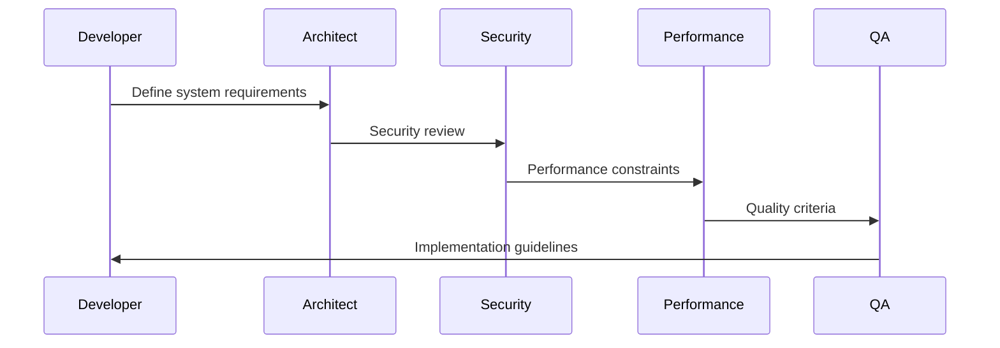

# 📋 Informe Ejecutivo: SuperClaude-Framework

**Repositorio**: SuperClaude-Framework  
**Fecha de Análisis**: 19 de julio 2025  
**Público Objetivo**: Desarrolladores hispanohablantes  
**Nivel**: Avanzado a Enterprise  

## 🎯 Resumen Ejecutivo

**SuperClaude-Framework v3.0.0** es el **sistema de extensión más avanzado y completo** para Claude Code, que transforma Claude en un asistente de desarrollo especializado de nivel enterprise mediante un ecosistema integrado de **comandos**, **personas expertas** y **servidores MCP**. Representa la culminación de la evolución de la metodología SuperClaude.

### Valor Principal
- **11 personas especializadas** con auto-activación inteligente
- **17 comandos avanzados** con namespace `/sc:`
- **4 servidores MCP integrados** para capacidades externas
- **Metodología Evidence-Based** que prohíbe lenguaje de marketing
- **Sistema de flags universal** para optimización de tokens

## 📚 Contenido y Estructura Documental

### Documentos Clave para Traducir

| Archivo | Prioridad | Complejidad | Horas Est. | Descripción |
|---------|-----------|-------------|------------|-------------|
| `README.md` | **Alta** | Media | 5h | Documentación framework completo |
| `SuperClaude/Core/COMMANDS.md` | **Alta** | Muy Alta | 12h | Sistema completo de 17 comandos |
| `SuperClaude/Core/PERSONAS.md` | **Alta** | Alta | 8h | 11 personas especializadas |
| `Docs/superclaude-user-guide.md` | Media | Alta | 10h | Guía completa del usuario |
| `SuperClaude/Core/CLAUDE.md` | **Alta** | Baja | 1h | Archivo de referencias |

**Total estimado**: **36 horas** de traducción especializada

### Arquitectura del Conocimiento

```
SuperClaude-Framework/
├── 📖 Documentación Central
│   ├── README.md                    # Overview del framework
│   └── Docs/superclaude-user-guide.md  # Guía completa
├── 🏗️ Core del Sistema
│   ├── SuperClaude/Core/
│   │   ├── CLAUDE.md               # Punto de entrada principal
│   │   ├── COMMANDS.md             # 17 comandos especializados
│   │   ├── PERSONAS.md             # 11 personas expertas
│   │   ├── MCP.md                  # 4 servidores MCP
│   │   └── FLAGS.md                # Sistema de flags universal
├── ⚙️ Comandos Especializados
│   └── SuperClaude/Commands/       # 17 comandos implementados
│       ├── implement.md            # NUEVO v3: Implementación
│       ├── workflow.md             # NUEVO v3: Flujos de trabajo
│       ├── analyze.md              # Análisis multidimensional
│       └── [14 comandos más...]
├── 🔧 Sistema de Instalación
│   └── setup/                      # Configuración automatizada
└── 📚 Documentación Extendida
    ├── Docs/commands-guide.md       # Guía detallada comandos
    ├── Docs/flags-guide.md          # Guía sistema de flags
    └── Docs/personas-guide.md       # Guía personas expertas
```

## 🧠 Conocimientos y Metodologías

### 1. Sistema de Personas (11 Especialistas)

#### Especialistas Técnicos
| Persona | Especialización | Aplicación |
|---------|----------------|------------|
| **architect** | Diseño de sistemas y arquitectura | Decisiones técnicas de alto nivel |
| **frontend** | UI/UX y accesibilidad | Interfaces de usuario modernas |
| **backend** | APIs y confiabilidad del sistema | Servicios robustos y escalables |
| **security** | Modelado de amenazas | Seguridad integrada desde diseño |
| **performance** | Optimización y análisis | Mejora de rendimiento sistemática |

#### Especialistas de Proceso
| Persona | Especialización | Aplicación |
|---------|----------------|------------|
| **analyzer** | Investigación y causa raíz | Debugging complejo y análisis |
| **qa** | Aseguramiento de calidad | Estrategias de testing comprehensivas |
| **refactorer** | Calidad de código | Reducción de deuda técnica |
| **devops** | Infraestructura y automatización | CI/CD y deployment |

#### Especialistas de Conocimiento
| Persona | Especialización | Aplicación |
|---------|----------------|------------|
| **mentor** | Transferencia de conocimiento | Educación y onboarding |
| **scribe** | Documentación profesional | Documentación técnica multiidioma |

### 2. Comandos Especializados (17 Comandos)

#### Comandos de Desarrollo (NUEVOS v3)
- `/sc:implement`: **Implementación de características** - Nuevo en v3
- `/sc:workflow`: **Generación de flujos de trabajo** desde PRDs - Nuevo en v3
- `/sc:build`: Constructor de proyectos inteligente
- `/sc:design`: Orquestación de diseño arquitectónico

#### Comandos de Planificación
- `/sc:estimate`: Estimación basada en evidencia (no "mejores prácticas")
- `/sc:task`: Gestión de proyectos a largo plazo
- `/sc:spec`: Especificaciones técnicas detalladas

#### Comandos de Análisis
- `/sc:analyze`: Análisis multidimensional de código
- `/sc:troubleshoot`: Investigación sistemática de problemas
- `/sc:explain`: Explicaciones educativas estructuradas

#### Comandos de Calidad
- `/sc:improve`: Mejora iterativa de código
- `/sc:cleanup`: Reducción de deuda técnica
- `/sc:test`: Flujos de trabajo de pruebas
- `/sc:review`: Revisión de código estructurada

#### Comandos Operacionales
- `/sc:deploy`: Estrategias de despliegue
- `/sc:monitor`: Monitoreo y observabilidad
- `/sc:optimize`: Optimización de rendimiento

### 3. Integración MCP (4 Servidores)

| Servidor | Funcionalidad | Aplicación |
|----------|---------------|------------|
| **Context7** | Documentación oficial de librerías | Acceso a docs actualizadas |
| **Sequential** | Análisis complejo multi-paso | Investigación profunda |
| **Magic** | Generación de componentes UI | Frontend moderno |
| **Playwright** | Automatización de navegador | Pruebas E2E y scraping |

### 4. Sistema de Flags Universal

#### Flags de Planificación
- `--plan`: Planificación básica estructurada
- `--think`: Análisis de complejidad moderada
- `--think-hard`: Análisis profundo para problemas complejos
- `--ultrathink`: Análisis exhaustivo para decisiones críticas

#### Flags de Optimización
- `--uc`: **UltraCompressed** (30-50% reducción de tokens)
- `--wave-mode`: Orquestación multi-fase para problemas complejos

#### Flags MCP
- `--c7`, `--seq`, `--magic`, `--play`: Activación de servidores específicos
- `--all-mcp`: Activación de todos los servidores MCP

#### Flags de Persona
- `--persona-[nombre]`: Activación manual de personas específicas

## 🛠️ Herramientas y Tecnologías

### Stack Tecnológico Enterprise
- **Frontend**: React, Vue, Angular con TypeScript
- **Backend**: Node.js, Express, APIs RESTful/GraphQL
- **Base de datos**: PostgreSQL, esquemas y migraciones
- **DevOps**: CI/CD, Docker, infraestructura como código
- **Pruebas**: Jest, Playwright, testing E2E
- **Monitoreo**: Observabilidad y métricas de performance

### Metodologías Avanzadas

#### Evidence-Based Development
- **Prohibición de "mejores prácticas"**: Solo evidencia específica
- **Documentación factual**: Sin lenguaje de marketing
- **Métricas reales**: Budgets de performance cuantificables
- **Decisiones basadas en datos**: No en opiniones o tendencias

#### Auto-activación Inteligente
- **Selección automática** de personas según contexto
- **Orquestación inteligente** de herramientas MCP
- **Optimización automática** de tokens según complejidad
- **Escalado dinámico** de recursos según necesidad

### Herramientas de Desarrollo Integradas
- **Git workflows** inteligentes con resolución automática
- **Análisis de seguridad** con OWASP Top 10 integrado
- **Optimización de rendimiento** con métricas Core Web Vitals
- **Gestión de tareas** jerárquica con dependencias
- **Generación de documentación** automática multiidioma

## 📈 Valor para Desarrolladores Hispanohablantes

### Beneficios Educativos Excepcionales

**Para Desarrolladores Avanzados**:
- ✅ **Metodología Evidence-Based**: Desarrollo científico, no basado en "mejores prácticas"
- ✅ **Arquitectura Enterprise**: Patrones de sistemas complejos y escalables
- ✅ **Seguridad Integrada**: Modelado de amenazas y cumplimiento normativo
- ✅ **Optimización Sistemática**: Métricas reales y budgets de performance

**Para Equipos Enterprise**:
- ✅ **Estándares Profesionales**: Metodologías de empresas tech avanzadas
- ✅ **Escalabilidad**: Patrones para sistemas de gran escala
- ✅ **Calidad Integrada**: QA y seguridad desde el diseño
- ✅ **Transferencia de Conocimiento**: Sistema mentor integrado

### Conocimientos Transferibles de Alto Valor

**Arquitectura de Software**:
- 🏗️ Diseño de sistemas distribuidos
- 🔗 Patrones de microservicios
- 🛡️ Arquitecturas seguras por diseño
- 📊 Observabilidad y monitoreo

**DevOps y Operaciones**:
- 🚀 CI/CD avanzado con múltiples entornos
- 🐳 Containerización y orquestación
- 📈 Infraestructura como código
- 🔍 Debugging de sistemas complejos

**Seguridad Aplicada**:
- 🛡️ Modelado de amenazas sistemático
- 🔐 Implementación de controles de seguridad
- 📋 Cumplimiento normativo (GDPR, etc.)
- 🚨 Respuesta a incidentes

**Performance Engineering**:
- ⚡ Optimización de frontend (Core Web Vitals)
- 🗄️ Optimización de backend y bases de datos
- 📊 Métricas y monitoreo de performance
- 💰 Budget de performance cuantificable

### Casos de Uso Enterprise

**Sistemas Financieros**:
- 🏦 APIs bancarias con alta disponibilidad
- 💳 Sistemas de pago seguros
- 📊 Análisis de riesgo en tiempo real
- 🔒 Cumplimiento PCI-DSS

**HealthTech**:
- 🏥 Sistemas de historia clínica
- 🔐 Cumplimiento HIPAA/GDPR
- 📱 Telemedicina escalable
- 🧬 Análisis de datos médicos

**GovTech**:
- 🏛️ Plataformas ciudadanas
- 🔐 Identidad digital segura
- 📋 Trámites digitales
- 🌐 Interoperabilidad entre sistemas

## 🔄 Flujos de Trabajo Enterprise

### 1. Flujo de Desarrollo con Personas



### 2. Orquestación MCP

- **Context7**: Documentación actualizada de librerías
- **Sequential**: Análisis complejo de arquitectura
- **Magic**: Generación de componentes UI
- **Playwright**: Validación E2E automatizada

### 3. Modo Wave para Complejidad Alta

**Activación automática** cuando complejidad ≥ 0.7:
1. **Fase 1**: Análisis inicial con múltiples personas
2. **Fase 2**: Diseño arquitectónico con validaciones
3. **Fase 3**: Implementación con testing continuo
4. **Fase 4**: Optimización y deployment

## 🎓 Dependencias de Aprendizaje

### Prerequisitos Técnicos Avanzados
- **Claude Code**: Configuración avanzada con MCP
- **Docker**: Para desarrollo y deployment
- **TypeScript**: Para desarrollo frontend/backend
- **PostgreSQL**: Para sistemas de datos complejos

### Prerequisitos de Conocimiento Enterprise
- **Arquitectura de software**: Sistemas distribuidos
- **DevOps**: CI/CD, infraestructura como código
- **Seguridad**: Modelado de amenazas, compliance
- **Performance**: Optimización sistemática

### Flujo de Aprendizaje Enterprise

```
1. README.md                    # Framework overview
   ↓
2. SuperClaude/Core/COMMANDS.md # Sistema de comandos (12h)
   ↓
3. SuperClaude/Core/PERSONAS.md # Personas especializadas
   ↓
4. Docs/superclaude-user-guide.md # Guía completa (10h)
   ↓
5. Casos de uso enterprise      # Implementaciones reales
   ↓
6. Optimización y scaling       # Performance avanzada
```

### Tiempo de Aprendizaje Estimado
- **Intermedio-Avanzado**: 40-60 horas
- **Enterprise**: 60-80 horas
- **Expertise completa**: 80-120 horas

## 🎯 Recomendaciones de Traducción

### Prioridad de Traducción Estratégica

**Fase 1 - Foundation** (2-3 semanas):
1. `README.md` - Overview del framework
2. `SuperClaude/Core/CLAUDE.md` - Referencias básicas

**Fase 2 - Core System** (4-6 semanas):
3. `SuperClaude/Core/PERSONAS.md` - Sistema de personas (8h)
4. `SuperClaude/Core/COMMANDS.md` - **CRÍTICO** - Sistema completo (12h)

**Fase 3 - Documentation** (3-4 semanas):
5. `Docs/superclaude-user-guide.md` - Guía completa (10h)

### Consideraciones Críticas

**Complejidad de COMMANDS.md**:
- ⚠️ **12 horas estimadas** - el archivo más complejo de los 3 repositorios
- 📋 **17 comandos especializados** con documentación técnica
- 🏗️ **Arquitectura enterprise** con patrones avanzados
- 🎯 **Crítico para funcionamiento** completo del framework

**ROI de Traducción**:
- 36 horas de traducción para framework enterprise completo
- Acceso a metodologías de desarrollo de nivel tech company
- Conocimientos transferibles de alto valor comercial

## 🔗 Relación con Otros Repositorios

### Posición en el Ecosistema

```
Context-Engineering-Intro (Fundamentos)
           ↓
PRPs-agentic-eng (Metodología Intermedia)
           ↓
SuperClaude-Framework (Enterprise/Avanzado) ← AQUÍ
```

### Diferenciadores Únicos

1. **Sistema de Personas**: Auto-activación inteligente de expertos
2. **Metodología Evidence-Based**: Prohibición de "mejores prácticas"
3. **Integración MCP**: Primera implementación completa
4. **Namespace de Comandos**: `/sc:` para evitar conflictos
5. **Optimización Automática**: UltraCompressed y Wave Mode

## 💡 Conclusión

SuperClaude-Framework v3.0.0 es el **framework más avanzado y completo** del ecosistema, representando el estado del arte en desarrollo asistido por IA para entornos enterprise. Su enfoque en **metodologías evidence-based**, **personas especializadas** y **orquestación inteligente** lo convierte en una herramienta transformacional.

**Valor estimado**: **Impacto excepcional** para desarrolladores y equipos enterprise, con 36 horas de traducción que pueden elevar significativamente el nivel de desarrollo de software en el ecosistema hispanohablante.

**Recomendación**: ⭐⭐⭐⭐⭐ **IMPRESCINDIBLE para traducción** - Framework enterprise que representa la frontera del desarrollo asistido por IA. Su traducción posicionaría la comunidad hispanohablante en la vanguardia tecnológica mundial.

**Consideración especial**: Dado su nivel avanzado, podría beneficiarse de traducción **después** de completar los dos repositorios anteriores, estableciendo así una progresión educativa completa.